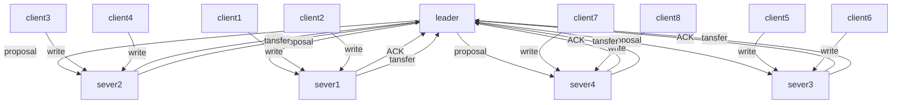
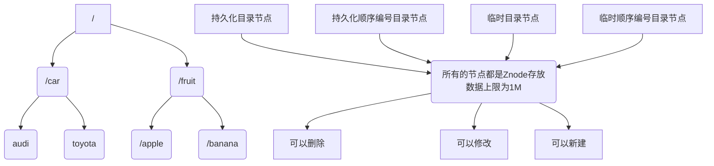
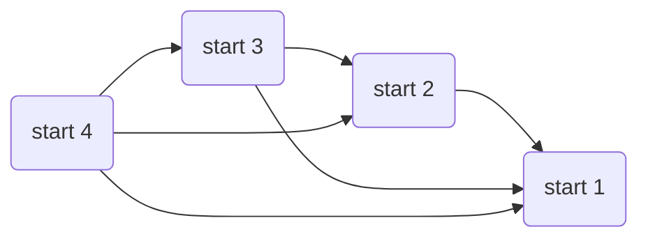
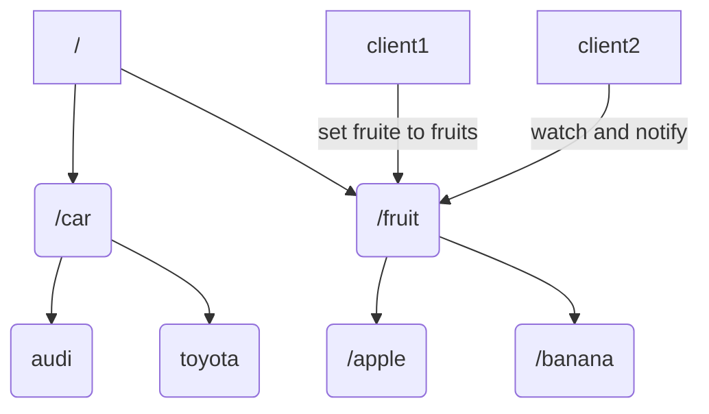
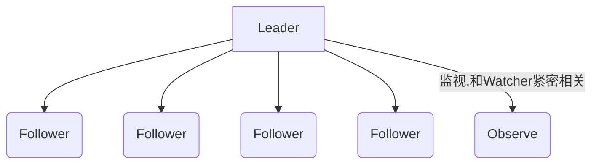

## Zookeeper

#### 架构




Zookeeper 分布式服务框架是Apache Hadoop 的一个子项目，它主要是用来解决分布式应用中经常遇到的一些数据管理问题，如：<font color=red>统一命名服务、状态同步服务、集群管理、分布式应用配置项的管理</font>等。ZooKeeper 的目标就是封装好复杂易出错的关键服务，将简单易用的接口和性能高效、功能稳定的系统提供给用户。



Zookeeper 保证了如下分布式一致性特性：

+ 顺序一致性

+ 原子性

+ 单一视图（全局数据一致）

+ 可靠性

+ 实时性（最终一致性）

四种节点类型：

+ PERSISTENT-持久节点： 除非手动删除，否则节点一直存在于Zookeeper上
+ EPHEMERAL-临时节点：临时节点的生命周期与客户端会话绑定，一旦客户端会话失效（客户端与zookeeper连接断开不一定会话失效），那么这个客户端创建的所有临时节点都会被移除。
+ PERSISTENT_SEQUENTIAL-持久顺序节点：基本特性同持久节点，只是增加了顺序属性，节点名后边会追加一个由父节点维护的自增整型数字。
+ EPHEMERAL_SEQUENTIAL-临时顺序节点：基本特性同临时节点，增加了顺序属性，节点名后边会追加一个由父节点维护的自增整型数字。

Zookeeper集群节点数量增加后，读请求吞吐会提高但是写请求吞吐会下降

#### 服务连接

建立连接时，只允许服务器ID较大者去连服务器ID较小者，小ID服务器去连大ID服务器会被拒绝。

+ 假设zk1 zk2 zk3 zk4四个服务节点依次启动
+ zk2连接zk1的3888端口，zk3分别连接zk1、zk2的3888端口，zk4分别连接zk1、zk2、zk3的3888端口，这样所有的服务节点建立了长连接




##  Zookeeper Watcher

Zookeeper允许客户端向服务端的某个Znode注册一个Watcher监听，当服务端的一些指定事件触发了这个Watcher，服务端会向指定客户端发送一个事件通知来实现分布式的通知功能，然后客户端根据Watcher通知状态和事件类型做出业务上的改变。

+ 客户端注册watcher
+ 服务端处理watcher
+ 客户端回调watcher

#### Watcher 流程



此时，client可以理解为发布者，client2为订阅者

#### watcher API

##### 客户端注册watcher实现

1. 调用 getData()/getChildren()/exist()三个 API，传入 Watcher 对象

   ```java
   zk.getData(znodePath, watcher); // 关注节点的数据变化
   zk.exists(znodePath, watcher); // 关注节点的存在与否的状态变化
   zk.getChildren(znodePath, watcher); // 关注节点的子节点个数变化
   ```

2. 标记请求 request，封装 Watcher 到 WatchRegistration

3. 封装成 Packet 对象，发服务端发送 request

4. 收到服务端响应后，将 Watcher 注册到 ZKWatcherManager 中进行管理

5. 请求返回，完成注册。

##### 服务端处理 Watcher 实现

1. 服务端接收 Watcher 并存储

   接收到客户端请求，处理请求判断是否需要注册 Watcher，需要的话将数据节点的节点路径和 ServerCnxn（ServerCnxn 代表一个客户端和服务端的连接，实现了 Watcher 的 process 接口，此时可以看成一个 Watcher 对象）存储在WatcherManager 的 WatchTable 和 watch2Paths 中去。

2. Watcher 触发

   以服务端接收到 setData() 事务请求触发 NodeDataChanged 事件为例：

   1. 封装 WatchedEvent

      将通知状态（SyncConnected）、事件类型（NodeDataChanged）以及节点路径封装成一个 WatchedEvent 对象

   2. 查询 Watcher

      1. 没找到：说明没有客户端在该数据节点上注册过 Watcher
      2. 找到：提取并从 WatchTable 和 Watch2Paths 中删除对应 Watcher（从这里可以看出 Watcher 在服务端是一次性的，触发一次就失效了）

3. 调用 process 方法来触发 Watcher:process 主要就是通过 ServerCnxn 对应的 TCP 连接发送 Watcher 事件通知。

##### 客户端回调Watcher

+ 客户端 SendThread 线程接收事件通知，交由 EventThread 线程回调 Watcher。
+ 客户端的 Watcher 机制同样是一次性的，一旦被触发后，该 Watcher 就失效了。

##### 触发watcher三种方式

```java
zk.setData(); // 更改节点数据，触发监听
zk.create(); // 创建节点
zk.delete(); // 删除节点
```

##### 四种事件类型

```java
NodeCreated // 节点被创建
NodeDeleted // 节点被删除
NodeDataChanged // 节点数据发生改变
NodeChildrenChanged // 节点的子节点个数发生改变
```

#### Watcher特性

+ 一次性：无论是服务端还是客户端，一旦一个Watcher被触发，Zookeeper都会将其从相应的存储中移除。
+ 客户端串行执行：客户端Watcher回调的过程是一个串行同步的过程。

+ 轻量
  + Watcher通知非常简单，只会告诉客户端发生了事件，而不会说明事件的具体内容。
  + 客户端向服务端注册Watcher的时候，并不会把客户端真实的Watcher对象实体传递到服务端，仅仅是在客户端请求中使用boolean类型属性进行了标记。
+ watcher event异步发送watcher的通知事件从server发送到client是异步的，这就存在一个问题，不同的客户端和服务器之间通过socket进行通信，由于网络延迟或其他因素导致客户端在不同的时刻监听到事件，由于Zookeeper本身提供了ordering guarantee，即客户端监听事件后，才会感知它所监视znode发生了变化。所以我们使用Zookeeper不能期望能够监控到节点每次的变化。Zookeeper只能保证最终的一致性，而无法保证强一致性。
+ 注册watcher getData、exists、getChildren
+ 触发watcher create、delete、setData
+ 当一个客户端连接到一个新的服务器上时，watch将会被以任意会话事件触发。当与一个服务器失去连接的时候，是无法接收到watch的。而当client重新连接时，如果需要的话，所有先前注册过的watch，都会被重新注册。通常这是完全透明的。只有在一个特殊情况下，watch可能会丢失：对于一个未创建的znode的exist watch，如果在客户端断开连接期间被创建了，并且随后在客户端连接上之前又删除了，这种情况下，这个watch事件可能会被丢失。

## ZAB （Zookeeper Atomic Broadcast）



<font color=blue>Zookeeper 中主要依赖 Zab 协议实现数据一致性。</font>基于该协议，Zookeeper 实现了一种主备模型（Leader 与 Follower）的系统架构保证集群中各个副本之间的数据一致性。

Zookeeper 集群中为保证任何进程能够顺序执行，只能是 Leader 服务器接收写请求，其他服务器接收到客户端的写请求，也会转发至 Leader 服务器进行处理。

### Zab 协议核心

在 Zookeeper 中只有一个 Leader，并且只有 Leader 可以处理外部客户端的事务请求，并将其转换成一个事务 Proposal（写操作），然后 Leader 服务器再将事务 Proposal 操作的数据同步到所有 Follower（数据广播/数据复制）。

Zookeeper 采用 Zab 协议的核心就是只要有一台服务器提交了 Proposal，就要确保所有服务器最终都能正确提交 Proposal，这也是 CAP/BASE 最终实现一致性的体现。

### Zab 协议模式

有两种模式：一种是消息广播模式，另一种是崩溃恢复模式。

#### 消息广播

在 Zookeeper 集群中数据副本的传递策略就是采用消息广播模式，Zookeeper 中的数据副本同步方式与2PC（Two-Phase Commit）方式相似但却不同，2PC是要求协调者必须等待<font color=blue>所有参与者全部反馈</font>ACK确认消息后，再发送 commit 消息，要求所有参与者要么全成功要么全失败，2PC方式会产生严重的阻塞问题。

而 Zookeeper 中 Leader 等待 Follower 的 ACK 反馈是指：只要<font color=red>半数以上(2N+1)</font>的 Follower 成功反馈即可，不需要收到全部的 Follower 反馈。

##### 消息广播步骤

+ 客户端发起一个写操作请求
+ Leader从客户端收到一个事务请求（如果是集群中其他机器接收到客户端的事务请求，会直接转发给 Leader 服务器），Leader 服务器处理客户端请求后将请求转换为 Proposal，同时为每个 Proposal 分配一个全局递增的唯一 ID，即 ZXID<font color=red>（通过其 ZXID 来进行排序保证顺序性）</font>
+ Leader 服务器与<font color=blue>每个</font> Follower 之间都有一个队列，Leader 将消息发送到该队列
+ Follower 机器从队列中取出消息处理完（写入本地事务日志中，并不commit）后，向 Leader 服务器发送 ACK 确认
+ Leader 服务器收到半数以上的 Follower 的 ACK 后，即认为可以发送 Commit
+ Leader 向所有的 Follower 服务器广播(发送) Commit 消息
+ 当 Follower 收到 commit 请求时，会判断该事务的 ZXID 是不是比历史队列中的任何事务的 ZXID 都<font color=red>小</font>，如果是则提交，如果不是则等待比它更小的事务的 commit

#### 崩溃恢复

一旦 Leader 服务器出现崩溃或者由于网络原因导致 Leader 服务器失去了与过半 Follower 的联系，那么就会进入崩溃恢复模式。

_Zab 协议崩溃恢复需满足以下2个请求：_

+ 确保已经被 Leader 提交的 proposal 必须最终被所有的 Follower 服务器提交

+ 确保丢弃已经被 Leader 提出的但没有被提交的 Proposal

也就是新选举出来的 Leader 不能包含未提交的 Proposal，必须都是已经提交了的 Proposal 的 Follower 服务器节点，新选举出来的 Leader 节点中含有最高的 ZXID，所以，在 Leader 选举时，将 ZXID 作为每个 Follower 投票时的信息依据。这样做的好处是避免了 Leader 服务器检查 Proposal 的提交和丢弃工作。

### 选举算法

+ 基于UDP的 LeaderElection （Deprecated）
+ 基于UDP的 FastLeaderElection （Deprecated）
+ 基于UDP和认证的 FastLeaderElection （Deprecated）
+ 基于TCP的FastLeaderElection

#### 基本定义

1. myid

   每个 Zookeeper 服务器，都需要在数据文件夹下创建一个名为 myid 的文件，该文件包含整个 Zookeeper 集群唯一的 ID，例如，某个 Zookeeper 集群包含三台服务器，hostname 分别为 zoo1,zoo2,zoo3，其中 myid 分别为1,2,3,则在配置文件中其 ID 与 hostname 必须一一对应，如在配置文件中，server.后面的数据即为 myid

   ```yaml
   server.1=zoo1:2888:3888
   server.2=zoo2:2888:3888
   server.3=zoo3:2888:3888
   ```

2. ZXID

   类似于 RDBMS 中的事务ID，也可以理解为是一个唯一的时间戳。用于标识一个 Proposal ID，为了保证顺序性，ZXID 必须单调递增，因此 Zookeeper 使用一个 64 位的数来表示，高 32 位是 Leader 的 epoch，从 1 开始，每次选出新的 Leader，epoch 加 1，低 32 位为该 epoch 内的序号，每次 epoch 变化，都将低 32 位的序号重置，这样保证了 ZXID 的全局递增性。

3. 服务器状态
   + Looking：不确定Leader状态，该状态下的服务器认为当前集群中没有Leader，会发起Leader选举
   + Following：跟随者状态，表明当前服务器角色是Follower，并且它知道Leader是谁
   + Leading：领导者状态，表明当前服务器角色是Leader，它会维护与Follower间的心跳
   + Observing：观察者状态，表明当前服务器角色是Observer，与Follower唯一的不同在于不参与选举，也不参与集群写操作时的投票

#### 选票数据结构

每个服务器在进行领导选举时，会发送如下关键信息：

+ ogicClock 每个服务器会维护一个自增的整数，名为logicClock，它表示这是该服务器发起的第多少轮投票
+ state 当前服务器的状态
+ self_id 当前服务器的myid
+ self_zxid 当前服务器上所保存的数据的最大zxid
+ vote_id 被推举的服务器的myid
+ vote_zxid 被推举的服务器上所保存的数据的最大zxid

#### 选举原理

1. 自增选举轮次

   Zookeeper 规定所有有效的投票都必须在同一轮次中，每个服务器在开始新一轮投票时，会先对自己维护的 logicClock 进行自增操作。

2. 初始化选票

   每个服务器在广播自己的选票前会将自己的投票箱清空，该投票箱记录了所收到的选票。

3. 发送初始化选票

   服务器会尝试从其他服务器获取投票，并计入自己的投票箱内，如果无法获取任何外部投票，则会确认自己是否与集群中其他服务器保持着有效连接，如果是，则发送自己的投票，如果否，则马上与之建立连接。

4. 判断选举轮次

   收到外部投票后，首先会根据投票信息中所包含的 logicClock 来进行不同处理：

   + 
   + 外部投票的logicClock小于自己的logicClock。当前服务器直接忽略该投票，继续处理下一个投票
   + 外部投票的logickClock与自己的相等，当时进行选票PK

5. 选票PK

   基于(self_id, self_zxid)与(vote_id, vote_zxid)的对比：

   + 外部投票的logicClock大于自己的logicClock，则将自己的logicClock及自己的选票的logicClock变更为收到的logicClock
   + 若logicClock一致，则对比二者的vote_zxid，若外部投票的vote_zxid比较大，则将自己的票中的vote_zxid与vote_myid更新为收到的票中的vote_zxid与vote_myid并广播出去，另外将收到的票及自己更新后的票放入自己的票箱。如果票箱内已存在(self_myid, self_zxid)相同的选票，则直接覆盖
   + 若二者vote_zxid一致，则比较二者的vote_myid，若外部投票的vote_myid比较大，则将自己的票中的vote_myid更新为收到的票中的vote_myid并广播出去，另外将收到的票及自己更新后的票放入自己的票箱

6. 统计选票

   如果已经确定有过半服务器认可了自己的投票（可能是更新后的投票），则终止投票。否则继续接收其它服务器的投票

7. 更新服务器状态

   投票终止后，服务器开始更新自身状态。若过半的票投给了自己，则将自己的服务器状态更新为LEADING，否则将自己的状态更新为FOLLOWING。
